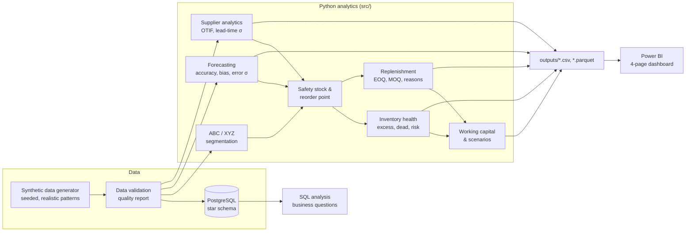

# Supply Chain Inventory Control Tower

[](https://github.com/Kadujay/supply-chain-inventory-control-tower/actions/workflows/tests.yml)


> **What should we order, when should we order it, and which inventory
> problems should management address first?**

A planning-analytics system for a fictional wholesale distributor with
**5,000 SKUs, 50 suppliers and 24 months of history**. It turns demand, inventory,
purchase-order and supplier-delivery data into **prioritised, explainable
replenishment and inventory decisions**. It is built with Python, PostgreSQL and
Power BI on **fully synthetic data**, and applies CSCP concepts: ABC-XYZ
segmentation, forecasting, periodic-review safety stock, supplier OTIF,
EOQ/MOQ lot sizing and working-capital analysis. Every formula is documented
and defensible.

> 🚧 **Build status:** Phases 1–2 of 12 complete (methodology, synthetic data and
> data-quality checks). See the [roadmap](#roadmap). Analytical result sections
> are placeholders until later phases.

**In two minutes:** [business problem](#1-business-problem) →
[what the system decides](#2-solution) → [methodology](docs/methodology.md) →
[interview guide](docs/interview_guide.md)

---

## 1. Business problem

Management sees **stockouts and excess at the same time**, which is the classic sign
of one inventory policy applied to every SKU:

| Symptom | Business cost |
|---|---|
| Stockouts on important SKUs | Lost sales (customers buy elsewhere), expediting cost |
| Excess and dead stock | Cash tied up, 25% annual carrying cost, write-offs |
| Unreliable supplier lead times | Higher safety stock or more stockouts |
| Demand variability and forecast bias | Wrong buffers, systematic over- or under-stocking |
| MOQ-driven buying | Stock held for the supplier's convenience |

Full context, stakeholders and success measures: [docs/business_logic.md](docs/business_logic.md).

## 2. Solution

| Step | What it does | Decision it supports |
|---|---|---|
| Segment | ABC (value) × XYZ (forecastability, ADI for intermittency) | Differentiated policy and service targets |
| Forecast | Naive, MA, SES, Holt trend, seasonal naive, chosen per SKU on a time-based hold-out | Demand to plan against; accuracy, bias, tracking signal |
| Assess suppliers | OTIF (strict, line-level), fill rate, lead-time variability, PPV | Supplier actions; lead-time σ feeds safety stock |
| Set policy | Periodic review (R, s, S): safety stock on forecast error + lead-time variability; reorder point over lead time + review period | *When* to order |
| Diagnose health | Stockout, critical, below ROP, excess (vs. policy max), dead stock, value at risk | *What first* |
| Recommend orders | EOQ / MOQ / order multiples, reason codes, **no order when excess**, projected reorder dates | *What* and *how much* |
| Quantify money | Inventory value, excess/dead share, turns, DIO, GMROI, carrying cost | Working-capital priorities |
| Run scenarios | Demand growth, service level, lead time, lead-time variability | S&OP trade-off discussion |

**Scope note:** "control tower" here means a *planning* control tower, i.e. one view of
inventory risk, causes and actions, refreshed each planning cycle. It is not a
real-time logistics tracking platform.

### Who uses it

| Stakeholder | Uses |
|---|---|
| Buyer / supply planner | Order recommendations with reason codes |
| Demand planner | Forecast accuracy, bias and tracking-signal alerts |
| Procurement | Supplier OTIF, lead-time variability, spend concentration |
| Supply chain manager / S&OP | Service-level and lead-time scenarios |
| Finance | Excess, dead stock, turns, DIO, carrying cost |

## 3. Technology

| Layer | Tools |
|---|---|
| Analytics | Python 3.11+, pandas, NumPy, SciPy, statsmodels |
| Database | PostgreSQL (star schema, CTEs, window functions) |
| Reporting | Power BI (CSV / Parquet datasets + build guide) |
| Quality | pytest, ruff, GitHub Actions |

No machine learning is used. With monthly univariate history, transparent
methods that planners can explain and override are the right tool. See the
[decision log](docs/decision_log.md).

## 4. CSCP concepts demonstrated

| Concept | Where |
|---|---|
| Demand management (orders vs. shipments, censored demand, lost sales) | [methodology §1](docs/methodology.md#1-demand-management) |
| ABC, XYZ, ABC-XYZ matrix | [§2–4](docs/methodology.md#2-abc-classification) |
| Forecasting, accuracy (MAE/RMSE/WAPE), bias, tracking signal, FVA | [§5–6](docs/methodology.md#5-demand-forecasting) |
| Periodic review, protection interval, lead-time demand | [§7](docs/methodology.md#7-inventory-policy-and-the-protection-interval) |
| Service levels (CSL target vs. fill rate achieved) | [§8](docs/methodology.md#8-service-levels) |
| Safety stock with demand and lead-time variability | [§9](docs/methodology.md#9-safety-stock) |
| Reorder point, inventory position | [§10](docs/methodology.md#10-reorder-point-and-inventory-position) |
| Inventory health, days of supply, excess, dead stock, stockout risk | [§11](docs/methodology.md#11-inventory-health-days-of-supply-excess-dead-stock-stockout-risk) |
| Supplier performance, OTIF, lead-time variability, PPV | [§12](docs/methodology.md#12-supplier-performance-and-otif) |
| Replenishment, EOQ, MOQ, order multiples | [§13](docs/methodology.md#13-replenishment-lot-sizing-moq-order-multiples-timing) |
| Carrying cost, working capital, turns, DIO, GMROI | [§14](docs/methodology.md#14-working-capital-and-inventory-productivity) |
| S&OP-style scenario analysis | [§15](docs/methodology.md#15-scenario-analysis-sop-style) |

## 5. Architecture



```
├── data/          raw/ and processed/ synthetic data (regenerated, not committed)
├── sql/           schema, seed, transformations, analysis queries (PostgreSQL)
├── src/           one module per business capability + pipeline orchestration
├── tests/         pytest unit tests for every business calculation
├── notebooks/     exploration & presentation (logic lives in src/)
├── outputs/       Power BI-ready result files
├── dashboard/     Power BI build guide and data dictionary
└── docs/          methodology, business logic, KPIs, assumptions, decisions, glossary, interview guide
```

Every business threshold lives in [`src/config.py`](src/config.py), including ABC cut-offs, CV
and ADI limits, service levels, review period, excess and dead-stock rules,
OTIF tolerances, ordering and carrying cost. Each one is validated on load
and documented in [assumptions.md](docs/assumptions.md).

## 6. How to run

```bash
git clone https://github.com/Kadujay/supply-chain-inventory-control-tower.git
cd supply-chain-inventory-control-tower
python -m venv .venv && source .venv/bin/activate   # Windows: .venv\Scripts\activate
pip install -r requirements.txt

pytest                      # run the test suite
python -m src.pipeline      # generate synthetic data (seed 42) and validate it
python -m src.pipeline --seed 7   # any other seed gives a different, equally realistic world
```

Generated data lands in `data/raw/` (git-ignored, reproducible); the
data-quality report in `outputs/data_quality_report.csv`.

PostgreSQL (from Phase 3):

```bash
cp .env.example .env        # fill in local credentials; .env is git-ignored
psql -d inventory_control_tower -f sql/schema.sql
```

## Synthetic dataset at a glance

Generated by simulating the company's current (flawed) buying rules against
realistic supplier behaviour, so the problems below *emerge* rather than being
painted on. Details: [data/README.md](data/README.md) ·
[profiling notebook](notebooks/01_data_exploration.ipynb).

| Measure (seed 42) | Value |
|---|---|
| SKUs / suppliers / months | 5,000 / 50 / 24 (Jan 2024 – Dec 2025) |
| Rows (demand, inventory, PO lines, receipts) | 114k, 114k, 36k, 37k |
| Unit fill rate | ≈ 90% (10% of SKU-months short) |
| Value concentration | ≈ 24% of SKUs = 80% of consumption value |
| Inventory at cost / turns | ≈ $17M / 3.6 (≈ 100 days) |
| Inventory value above 6 months of supply | ≈ 24% |
| Dead-stock candidates (no demand in 6 months) | 238 SKUs, ≈ 6% of value |
| PO lines received late / split | ≈ 15% / 5% |
| Data-quality checks | 40 checks, 0 errors |

## 7. Example outputs

*Placeholder, populated with real result excerpts in Phases 11–12.*

| Output | Answers |
|---|---|
| `replenishment_recommendations.csv` | What to order, how much, why, and when upcoming orders fall due |
| `inventory_health.csv` | Which SKUs are at risk or over-stocked, ranked by money at stake |
| `supplier_performance.csv` | Which suppliers drive stockouts and safety stock |
| `forecast_results.csv` | How accurate and biased the forecast is |
| `executive_kpis.csv` | Headline KPIs: actuals vs. scenario projections |

### Dashboard

*Screenshots added once the Power BI report is built. See the
[Power BI guide](dashboard/POWER_BI_GUIDE.md).*

| Page | Question | Preview |
|---|---|---|
| Executive Overview | Where is the capital and what is at risk? | _placeholder_ |
| Inventory & Replenishment | What should we order now? | _placeholder_ |
| Demand Planning | How good and how biased is the forecast? | _placeholder_ |
| Supplier Performance | Which suppliers drive our problems? | _placeholder_ |

## 8. Business insights

*Placeholder, written from actual results in Phase 12.*

## Why this matters

Inventory is usually one of a distributor's largest assets. The analysis that
prevents stockouts on critical items also exposes cash locked in excess and
dead stock. The project makes the trade-offs **explicit and quantified**:

- Higher service level → more safety stock → more working capital → fewer stockouts (non-linear)
- Higher MOQ → fewer orders → more inventory held
- Longer or less reliable lead times → more inventory, earlier orders, more exposure
- Longer review period → larger protection interval → more safety stock
- Forecast bias → systematic excess or systematic shortage

## 9. Limitations

- Synthetic data: realistic patterns by design, but not real-world messiness.
- Normal-based safety stock is weakest for intermittent (Z) items (flagged low-confidence).
- Univariate forecasts: no promotions, pricing or causal drivers.
- Single DC, one supplier per SKU, no capacity/budget constraints, lost-sales model.

Full list: [assumptions.md](docs/assumptions.md).

## 10. Future improvements

- Croston / SBA forecasting for intermittent demand
- Fill-rate-based safety stock alongside cycle service level
- Lost-sales imputation for residual censored demand
- Multi-echelon inventory, quantity discounts, supplier-level order constraints
- Scheduled orchestration, incremental loads, planner override capture

## Interview discussion points

There are prepared answers to 26 questions, including the ones experienced interviewers
ask: why the reorder point covers the review period, why safety stock uses forecast
error, why no ML, EOQ vs. MOQ, and "how do you know your numbers are right?".
See **[docs/interview_guide.md](docs/interview_guide.md)**.

## Roadmap

| Phase | Scope | Status |
|---|---|---|
| 1 | Architecture, methodology & documentation (reviewed and revised) | ✅ |
| 2 | Synthetic data generation & data-quality checks | ✅ |
| 3 | PostgreSQL schema & SQL analytics | ⏳ |
| 4 | ABC / XYZ analysis | ⏳ |
| 5 | Forecasting & accuracy | ⏳ |
| 6 | Supplier analytics *(moved ahead: safety stock needs lead-time σ)* | ⏳ |
| 7 | Safety stock, reorder point & inventory health | ⏳ |
| 8 | Replenishment engine | ⏳ |
| 9 | Working capital & scenario analysis | ⏳ |
| 10 | Test suite completion | ⏳ |
| 11 | Power BI datasets & documentation | ⏳ |
| 12 | Code & business-logic audit | ⏳ |

## Documentation

| Document | Purpose |
|---|---|
| [Methodology](docs/methodology.md) | Every formula, specified before implementation |
| [Business logic](docs/business_logic.md) | Context, stakeholders, decisions, trade-offs, prioritisation |
| [KPI definitions](docs/kpi_definitions.md) | One definition per KPI, with owner and direction |
| [Assumptions](docs/assumptions.md) | What is assumed, why, and what changes in reality |
| [Decision log](docs/decision_log.md) | Chosen approach vs. alternatives |
| [Glossary](docs/glossary.md) | CSCP terms in plain language |
| [Interview guide](docs/interview_guide.md) | Prepared answers |
| [Power BI guide](dashboard/POWER_BI_GUIDE.md) · [Data dictionary](dashboard/DATA_DICTIONARY.md) | Dashboard build |

## Data disclaimer

All data is synthetic and generated with a fixed random seed. The company is
fictional. No confidential employer or proprietary data is used.

## License

[MIT](LICENSE)
