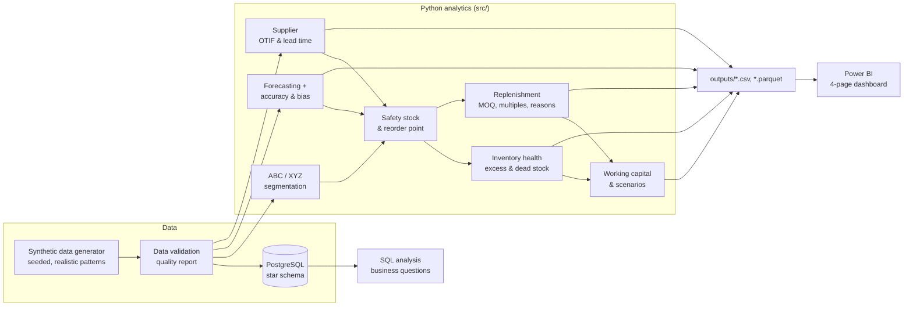

# Supply Chain Inventory Control Tower

[](https://github.com/Kadujay/Retail-Demand-Planning-SQL-Analysis/actions/workflows/tests.yml)


> **What should we order, when should we order it, and which inventory
> problems should management address first?**

An end-to-end inventory analytics system for a wholesale distributor
(5,000 SKUs, 50 suppliers, 24 months of history), built with Python,
PostgreSQL and Power BI on **fully synthetic data**. It applies CSCP
concepts — ABC-XYZ segmentation, forecasting, safety stock, reorder points,
supplier OTIF, replenishment with MOQs, and working-capital analysis — with
every formula documented and explainable.

> 🚧 **Build status:** Phase 1 of 12 complete (architecture & documentation).
> See the [roadmap](#roadmap). Result sections below are placeholders until
> the pipeline is built.

---

## 1. Business problem

A distributor managing thousands of SKUs faces problems that pull in opposite
directions:

| Symptom | Business cost |
|---|---|
| Stockouts on important SKUs | Lost sales, unhappy customers, expediting cost |
| Excess and dead stock | Cash tied up, carrying cost, write-offs |
| Unreliable supplier lead times | Higher safety stock or more stockouts |
| Demand variability | Forecast error, wrong buffers |
| One-size-fits-all replenishment | Over-protection of cheap items, under-protection of critical ones |

## 2. Solution

A control tower that turns raw operational data into **prioritised,
explainable decisions**:

1. **Segment** SKUs by value (ABC) and variability (XYZ) → differentiated policy.
2. **Forecast** demand with transparent methods, chosen per SKU by hold-out accuracy.
3. **Size buffers** — safety stock and reorder points from service level, demand and lead-time variability.
4. **Diagnose** inventory health — stockout, critical, below ROP, excess, dead stock.
5. **Evaluate suppliers** — OTIF, fill rate, lead-time variability, spend.
6. **Recommend orders** — respecting MOQ and order multiples, with a reason code, and *no order* when stock is already excessive.
7. **Quantify working capital** and run **S&OP-style scenarios** (demand growth, service level, lead time).

## 3. Technology

| Layer | Tools |
|---|---|
| Analytics | Python 3.11+, pandas, NumPy, SciPy, statsmodels |
| Database | PostgreSQL (star schema, CTEs, window functions) |
| Reporting | Power BI (CSV / Parquet datasets + build guide) |
| Quality | pytest, ruff, GitHub Actions |

## 4. CSCP concepts demonstrated

| Concept | Where |
|---|---|
| Demand management, forecasting, accuracy (MAE/RMSE/WAPE), bias | [methodology §1, §5–6](docs/methodology.md) |
| ABC, XYZ, ABC-XYZ matrix | [methodology §2–4](docs/methodology.md) |
| Service levels, safety stock, lead-time demand, reorder point | [methodology §7–10](docs/methodology.md) |
| Inventory health, days of supply, excess, dead stock, stockout risk | [methodology §11](docs/methodology.md) |
| Supplier performance, OTIF, lead-time variability | [methodology §12](docs/methodology.md) |
| Replenishment planning, MOQ, order multiples | [methodology §13](docs/methodology.md) |
| Carrying cost, working capital | [methodology §14](docs/methodology.md) |
| S&OP scenario analysis | [methodology §15](docs/methodology.md) |

## 5. Architecture



Repository layout:

```
├── data/          raw/ and processed/ synthetic data (regenerated, not committed)
├── sql/           schema, seed, transformations, analysis queries (PostgreSQL)
├── src/           one module per business capability + pipeline orchestration
├── tests/         pytest unit tests for every business calculation
├── notebooks/     exploration & presentation (logic lives in src/)
├── outputs/       Power BI-ready result files
├── dashboard/     Power BI build guide and data dictionary
└── docs/          methodology, business logic, assumptions, interview guide
```

All business thresholds (ABC cut-offs, CV limits, service levels, excess and
dead-stock rules, OTIF tolerances, carrying-cost rate) live in
[`src/config.py`](src/config.py).

## 6. How to run

```bash
git clone https://github.com/Kadujay/Retail-Demand-Planning-SQL-Analysis.git
cd Retail-Demand-Planning-SQL-Analysis
python -m venv .venv && source .venv/bin/activate   # Windows: .venv\Scripts\activate
pip install -r requirements.txt

pytest                      # run the test suite
python -m src.pipeline      # run the pipeline (stages added phase by phase)
```

PostgreSQL (optional, from Phase 3):

```bash
cp .env.example .env        # fill in your local credentials
psql -d inventory_control_tower -f sql/schema.sql
```

## 7. Example outputs

*Placeholder — populated in Phase 11/12 with real result excerpts.*

| Output | Answers |
|---|---|
| `replenishment_recommendations.csv` | What to order, how much, and why |
| `inventory_health.csv` | Which SKUs are at risk or over-stocked |
| `supplier_performance.csv` | Which suppliers drive the problems |
| `forecast_results.csv` | How accurate and biased the forecast is |
| `executive_kpis.csv` | Headline KPIs, base case vs. scenarios |

### Dashboard

*Screenshots added once the Power BI report is built — see
[POWER_BI_GUIDE.md](dashboard/POWER_BI_GUIDE.md).*

| Page | Preview |
|---|---|
| Executive Overview | _placeholder_ |
| Inventory & Replenishment | _placeholder_ |
| Demand Planning | _placeholder_ |
| Supplier Performance | _placeholder_ |

## 8. Business insights

*Placeholder — written from actual results in Phase 12.*

## Why this matters

Inventory is usually one of a distributor's largest assets. The same
analysis that prevents stockouts on critical items also exposes cash locked
in excess and dead stock. This project makes the trade-offs **explicit and
quantified**:

- Higher service level → more safety stock → more working capital → fewer stockouts
- Higher MOQ → fewer orders → more inventory held
- Longer / less reliable lead times → more inventory required → more exposure
- Forecast bias → systematic excess or systematic shortage

## 9. Limitations

- Synthetic data: realistic patterns by design, but not real-world messiness.
- Normal-demand safety stock is weakest for intermittent (Z) items.
- Univariate forecasts — no promotions, pricing or causal drivers.
- Single warehouse, one supplier per SKU, no capacity or budget constraints.

Full list: [docs/assumptions.md](docs/assumptions.md).

## 10. Future improvements

- Croston / SBA forecasting for intermittent demand
- Safety stock from forecast-error distribution instead of demand σ
- Fill-rate-based safety stock alongside cycle service level
- Lost-sales imputation for stockout months
- Multi-echelon inventory and EOQ / quantity-discount optimisation
- Scheduled orchestration and incremental database loads

## Interview discussion points

Prepared answers to 18 common questions (ABC vs. XYZ, safety stock, service
levels, time-series validation, bias, MOQ, inventory position, OTIF, working
capital, scenarios, deployment): **[docs/interview_guide.md](docs/interview_guide.md)**.

## Roadmap

| Phase | Scope | Status |
|---|---|---|
| 1 | Repository architecture & documentation | ✅ |
| 2 | Synthetic data generation & data-quality checks | ⏳ |
| 3 | PostgreSQL schema & SQL analytics | ⏳ |
| 4 | ABC / XYZ analysis | ⏳ |
| 5 | Forecasting & accuracy | ⏳ |
| 6 | Safety stock & inventory health | ⏳ |
| 7 | Supplier analytics | ⏳ |
| 8 | Replenishment engine | ⏳ |
| 9 | Working capital & scenario analysis | ⏳ |
| 10 | Test suite completion | ⏳ |
| 11 | Power BI datasets & documentation | ⏳ |
| 12 | Code & business-logic audit | ⏳ |

## Documentation

- [Methodology](docs/methodology.md) — every formula, before implementation
- [Business logic](docs/business_logic.md) — why each metric matters and which decision it drives
- [Assumptions](docs/assumptions.md)
- [Interview guide](docs/interview_guide.md)
- [Power BI guide](dashboard/POWER_BI_GUIDE.md) · [Data dictionary](dashboard/DATA_DICTIONARY.md)

## Data disclaimer

All data is synthetic and generated with a fixed random seed. No
confidential employer or proprietary company data is used.

## License

[MIT](LICENSE)
