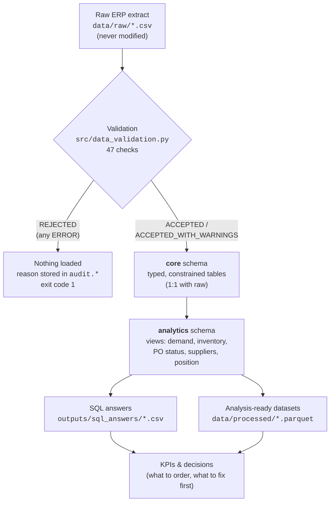
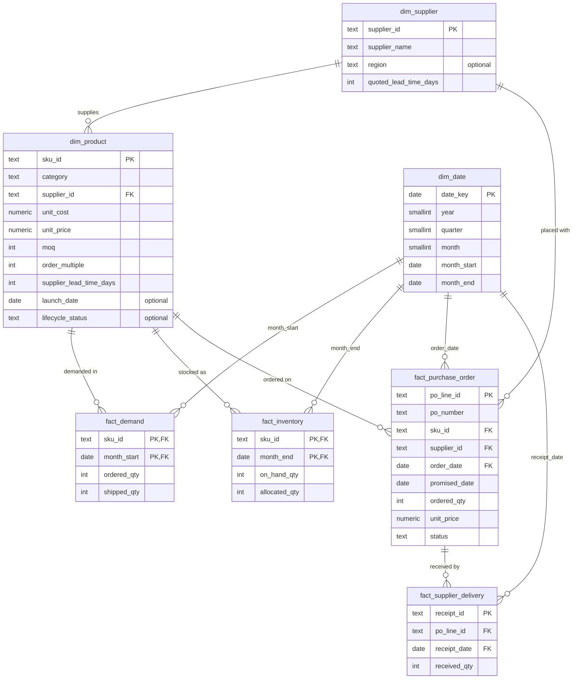

# Database Architecture

How operational supply-chain data becomes analysis-ready data, and why each
table exists. SQL lives in [`sql/`](../sql); the loader in
[`src/database.py`](../src/database.py). Column-level definitions are in
[`data_dictionary.md`](data_dictionary.md); a walkthrough of every query is in
[`sql_guide.md`](sql_guide.md).

## 1. Design goals

1. **Traceable lineage.** Every number can be traced back to a raw row.
2. **Nothing invalid is loaded silently.** Validation gates every load, and the
   database enforces hard rules a second time.
3. **Facts, not opinions, in storage.** Tables hold what happened (orders,
   shipments, stock, POs, receipts). Classifications such as ABC, XYZ or
   inventory health are *derived* and never stored in the operational tables.
4. **Understandable, not enterprise.** Three schemas, seven tables, eight
   views. A star-schema-style layout that a planner can read.

## 2. Data lineage

| Stage | Where | Written by | Can it change the stage before? |
|---|---|---|---|
| Raw | `data/raw/*.csv` | `python -m src.data_generation` | — (source of record) |
| Validation | `outputs/data_quality_report.csv`, `audit.*` | `python -m src.data_validation`, loader | No |
| Cleaned / transformed | `core.*` | `python -m src.database load` | No — raw files are read-only |
| Analytical | `analytics.v_*` | `sql/transformations.sql` | No — views only read `core` |
| Outputs | `outputs/sql_answers/`, `data/processed/` | `analyze`, `export` | No |

*Cleaned* here means **validated and typed**, not corrected. The project
refuses bad data rather than silently repairing it: a real analyst should push
fixes back to the source system, not patch them in a report.

## 3. Schemas

| Schema | Contents | Why separate |
|---|---|---|
| `core` | Dimensions and facts loaded from the extract | The trusted, constrained record of what happened |
| `analytics` | Views + the planning-parameter table | Derived logic, rebuildable at any time without reloading |
| `audit` | Load attempts and their data-quality results | Proves what was loaded, when, and why anything was rejected |

## 4. Entity-relationship diagram

## 5. Tables: why each exists, and its grain

### `core.dim_supplier`
- **Grain:** one row = one supplier.
- **PK:** `supplier_id`. **FKs:** none.
- **Why it exists:** supplier scorecards (spend, OTIF, lead time) need a single
  list of suppliers to attach to. Quoted lead time is master data; actual lead
  time is measured from the fact tables.
- **Important columns:** `quoted_lead_time_days` (what the supplier promises),
  `region` (domestic vs. import; optional).

### `core.dim_product`
- **Grain:** one row = one SKU.
- **PK:** `sku_id`. **FKs:** `supplier_id → dim_supplier`.
- **Why it exists:** the item master. Every quantity becomes money through
  `unit_cost` (inventory value, COGS) and `unit_price` (revenue, lost sales).
  `moq` and `order_multiple` constrain what can be ordered.
- **Business meaning:** one primary supplier per SKU (assumption D5).
  `lifecycle_status` is maintained imperfectly, as in real ERPs, so SQL
  derives dead-stock candidates from demand instead of trusting the flag.

### `core.dim_date`
- **Grain:** one row = one calendar day, from 1 January of the year before the
  history window to 31 December of the year after it (2023-01-01 to 2026-12-31 by
  default; derived from `config.py` so fact dates always fall inside it).
- **PK:** `date_key`.
- **Why it exists:** a single calendar for monthly facts (joined on month start
  or month end) and daily events (PO and receipt dates). It is daily because
  lead time and OTIF are measured in days. Power BI needs one date table to
  relate everything to.
- **Why generated:** it is reference data, not ERP data (`sql/seed.sql`).

### `core.fact_demand`
- **Grain:** one row = one SKU in one calendar month, from the SKU's launch
  month. Months with zero demand are included.
- **PK:** `(sku_id, month_start)`. **FKs:** `sku_id → dim_product`,
  `month_start → dim_date`.
- **Why it exists:** customer **demand** (`ordered_qty`) and customer
  **shipments** (`shipped_qty`) are different facts. Stockouts make shipments
  fall below demand, so forecasting on shipments would understate demand. The
  gap is lost sales.
- **Constraints:** `shipped_qty <= ordered_qty`; `month_start` is day 1.

### `core.fact_inventory`
- **Grain:** one row = one SKU's stock position at one month end.
- **PK:** `(sku_id, month_end)`. **FKs:** `sku_id`, `month_end → dim_date`.
- **Why it exists:** on-hand stock is a *snapshot* (a balance), not a flow, so
  it gets its own fact table. It is a separate concept from demand, open POs
  and receipts. Month-end snapshots give the inventory trend and average
  inventory for turns.
- **Important columns:** `on_hand_qty` (physical), `allocated_qty` (committed to
  customers, not available for new demand).

### `core.fact_purchase_order`
- **Grain:** one row = one purchase-order **line** (one SKU on one PO).
- **PK:** `po_line_id`. **FKs:** `sku_id`, `supplier_id`, `order_date → dim_date`.
- **Why it exists:** POs are the supply pipeline. Open lines feed inventory
  position; closed lines measure supplier performance.
- **Business meaning:** `promised_date` is the **original** promise (OTIF is
  measured against it). `status` is as of the extract date. Open quantity is
  *derived* (ordered − received), never stored, so it cannot disagree with the
  receipts.

### `core.fact_supplier_delivery`
- **Grain:** one row = one goods receipt against one PO line. A partial
  delivery creates several rows for the same line.
- **PK:** `receipt_id`. **FKs:** `po_line_id → fact_purchase_order`,
  `receipt_date → dim_date`.
- **Why it exists:** received quantities and dates are what actually arrived.
  They drive stock increases, actual lead time, fill rate and OTIF. Keeping
  receipts separate from PO lines is what makes partial deliveries visible.

### `analytics.planning_parameter`
- **Grain:** one row = one named threshold.
- **Why it exists:** SQL screens need thresholds (review period, dead-stock
  months, OTIF tolerance). The loader writes them from `src/config.py`, so SQL
  and Python can never use different values. Nothing is hard-coded in SQL.

### `audit.load_run` and `audit.data_quality_result`
- **Grain:** one row per load attempt, and one row per check per attempt.
- **Why they exist:** a rejected load leaves evidence (which checks failed, how
  many rows), and an accepted load records its row count and warnings.

## 6. Analytical views

| View | Grain | Business question |
|---|---|---|
| `v_parameters` | 1 row | Which thresholds are in force? |
| `v_as_of` | 1 row | What is "today" for this extract? (latest snapshot, never `now()`) |
| `v_demand_monthly` | SKU × month | Demand vs. shipments, lost sales, fill rate, rolling demand, stockout months |
| `v_receipts_monthly` | SKU × month | What did suppliers deliver? |
| `v_inventory_monthly` | SKU × month end | Stock, value, and a stock-flow reconciliation (`balance_difference = 0`) |
| `v_po_line_status` | PO line | Open qty, split deliveries, actual lead time, days late, OTIF, stale flag |
| `v_supplier_performance` | supplier | Spend and share, OTIF, fill rate, lead-time mean / median / P90 / CV, PPV |
| `v_inventory_position` | SKU (as of) | Position, value, days of supply, screening ROP, high-cover and dead-stock flags |

Why views and not tables: the data volume is small (~300k rows), views cannot
go stale, and the logic stays visible in SQL. If volumes grew, the heavier views
would become materialized views without changing any consumer.

## 7. Constraints: what the database enforces vs. what validation warns about

| Rule | Where | Why there |
|---|---|---|
| Keys unique, references exist | PK / FK | Must always hold |
| Quantities ≥ 0, prices > 0, shipped ≤ ordered, promised ≥ ordered date, valid status | `CHECK` | Physically impossible otherwise |
| Month-start / month-end dates | `CHECK` | Guarantees the documented grain |
| Receipt on/after order date, duplicate receipts, UoM spikes, lead time ≤ 365 days | Python validation (ERROR) | Needs cross-table or statistical logic |
| Price below cost, allocated > on hand, stale open PO, missing optional fields, PO supplier ≠ item-master supplier | Python validation (WARNING) | Can legitimately happen, so data still loads |

The database constraints are the **second line of defence**. If data ever
passed validation but broke a constraint, the load transaction rolls back and
`audit.load_run` records `FAILED`.

## 8. Indexes

| Index | Supports |
|---|---|
| PKs (automatic) | Row lookups; composite PKs cover "by SKU" access to monthly facts |
| `dim_product (supplier_id)`, `(category)` | Supplier and category roll-ups |
| `fact_demand (month_start)` | Monthly totals and trailing-window filters |
| `fact_inventory (month_end)` | "Latest snapshot" lookups |
| `fact_purchase_order (sku_id)` | Open supply per SKU |
| `fact_purchase_order (supplier_id, order_date)` | Supplier scorecards over time |
| Partial index on open PO lines | Inventory position reads only open lines (~2% of rows) |
| `fact_supplier_delivery (po_line_id)`, `(receipt_date)` | PO-to-receipt join; receipts per month |

No index exists "just in case": each one serves a join or filter used by a view.

## 9. Design decisions

| Decision | Alternative | Reason |
|---|---|---|
| Natural keys (`SKU-00001`) | Surrogate integer keys | ERP keys are stable and readable; there is no slowly-changing history to track |
| Daily `dim_date` | Monthly calendar | Lead time and OTIF are measured in days |
| One primary supplier on `dim_product` | Bridge table for multi-sourcing | Matches the assumption; POs still carry their own `supplier_id` |
| Open quantity derived, not stored | `open_qty` column | Cannot contradict the receipts |
| Views over tables | ETL into summary tables | Always current, logic visible, small data |
| Python validation + DB constraints | Constraints only | Some rules are cross-table or statistical; warnings must not block loads |
| Load all tables in one transaction | Table-by-table | A failed load never leaves half-new, half-old data |
