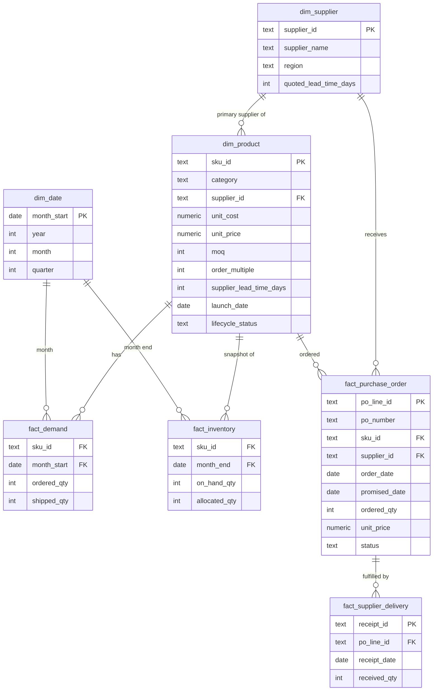

# Methodology

This document defines **every business calculation before it is implemented**:
the formula, the business reasoning, the chosen approach where several exist,
and known limitations. Thresholds referenced here live in
[`src/config.py`](../src/config.py) — nothing is hard-coded in the analytical
modules. KPI definitions used on the dashboard are in
[`kpi_definitions.md`](kpi_definitions.md); design choices and rejected
alternatives are logged in [`decision_log.md`](decision_log.md).

> Each section is marked with the phase that implements it. If implementation
> reveals that a definition must change, this document is updated in the same
> commit.

## Contents

1. [Demand management](#1-demand-management)
2. [ABC classification](#2-abc-classification)
3. [XYZ classification](#3-xyz-classification)
4. [ABC-XYZ matrix](#4-abc-xyz-matrix)
5. [Demand forecasting](#5-demand-forecasting)
6. [Forecast accuracy, bias and tracking signal](#6-forecast-accuracy-bias-and-tracking-signal)
7. [Inventory policy and the protection interval](#7-inventory-policy-and-the-protection-interval)
8. [Service levels](#8-service-levels)
9. [Safety stock](#9-safety-stock)
10. [Reorder point and inventory position](#10-reorder-point-and-inventory-position)
11. [Inventory health, days of supply, excess, dead stock, stockout risk](#11-inventory-health-days-of-supply-excess-dead-stock-stockout-risk)
12. [Supplier performance and OTIF](#12-supplier-performance-and-otif)
13. [Replenishment: lot sizing, MOQ, order multiples, timing](#13-replenishment-lot-sizing-moq-order-multiples-timing)
14. [Working capital and inventory productivity](#14-working-capital-and-inventory-productivity)
15. [Scenario analysis (S&OP-style)](#15-scenario-analysis-sop-style)
16. [Data model](#16-data-model)

## Notation

| Symbol | Meaning | Unit |
|---|---|---|
| `d` | Forecast demand per month | units / month |
| `σ` | Std. dev. of monthly forecast error (fallback: of monthly demand) | units / month |
| `L` | Mean supplier lead time | months (from days ÷ 30.42) |
| `σ_L` | Std. dev. of supplier lead time | months |
| `R` | Review period (time between planning runs) | months |
| `P = L + R` | Protection interval | months |
| `Z` | Standard-normal quantile of target cycle service level | – |
| `c`, `p` | Unit cost, unit selling price | USD / unit |
| `IP` | Inventory position | units |

**Unit consistency:** demand and lead time must be in the same time unit
before they are combined. Lead-time days are converted with
`DAYS_PER_MONTH = 365 / 12`.

---

## 1. Demand management

*Phase 2 (data) / Phase 5 (forecasting)*

**Demand signal.** Demand is recorded as monthly **customer order quantity**
(`ordered_qty`) alongside **shipped quantity** (`shipped_qty`) per SKU. This
mirrors how a distributor's ERP captures sales orders vs. deliveries, and it
matters because:

- forecasting on shipments would understate demand whenever stock ran out
  (censored demand) and bake past stockouts into the future forecast;
- `shipped / ordered` gives a *measured* fill rate, so achieved service level
  can be reported against target (see §8).

**Unfilled demand is assumed lost, not backordered.** Wholesale customers
typically source elsewhere when an item is unavailable. Consequently there
is no backorder quantity in inventory position. Residual censoring remains
(some customers never place an order they know cannot be filled) and is
documented as a limitation.

**Lifecycle handling.** New SKUs (history shorter than
`XYZConfig.min_history_months`) are flagged `NEW` and forecast from available
history pending planner review; declining SKUs are handled by the trend
method (§5) and surface in dead/excess analysis.

## 2. ABC classification

*Phase 4 — `src/abc_xyz.py`*

```
annual_consumption_value (ACV) = Σ ordered_qty (last 12 months) × unit_cost
```

1. Compute ACV per SKU over the trailing `ABCConfig.window_months` (12).
2. Rank SKUs by ACV descending.
3. Compute each SKU's cumulative share of total ACV.
4. Classify by the cumulative share **before** the SKU is added:
   A if < 80%, B if < 95%, else C.

Using the *previous* cumulative share guarantees the SKU that crosses the 80%
line is still an A item (otherwise the single largest SKU could become B in a
very concentrated portfolio).

**Why it matters.** Planner time and working capital are finite. ABC (Pareto)
concentrates control, service level and review frequency where the
inventory investment is.

**Why cost, not revenue.** ACV at cost measures the inventory investment a SKU
drives, which is what inventory policy controls. Revenue/margin ranking is a
valid alternative for commercial prioritisation (logged in the decision log).

**Why 12 months.** Reflects the current mix (a product declining for two years
should not stay A) and contains every season exactly once.

**Why configurable.** 80/95 is a convention. A highly concentrated portfolio
might use 70/90; more planner capacity might justify a wider A class.

**Limitations.** One-dimensional: a cheap but critical item can be C. Ignores
variability — hence XYZ.

## 3. XYZ classification

*Phase 4 — `src/abc_xyz.py`*

Evaluated over the same 12-month window as ABC, in this order:

| Step | Rule | Result | Reason |
|---|---|---|---|
| 1 | No demand in window | `NO_DEMAND` | CV undefined (0/0); dead-stock candidate, not a planning item |
| 2 | Months since launch < `min_history_months` (6) | `NEW` (flag) | Too little history; planner review |
| 3 | ADI > 1.32 | Z (flag `intermittent`) | Intermittent demand (Syntetos–Boylan–Croston cut-off) |
| 4 | CV ≤ 0.50 | X | Stable, forecastable |
| 5 | 0.50 < CV ≤ 1.00 | Y | Moderately variable |
| 6 | CV > 1.00 | Z | Highly variable |

```
CV  = std(monthly demand, ddof=1) / mean(monthly demand)
ADI = number of periods / number of periods with demand > 0
```

With 12 monthly periods, ADI > 1.32 means demand in fewer than 10 of 12
months. ADI is used instead of an ad-hoc "minimum non-zero months" rule
because it is the recognised intermittency criterion from the forecasting
literature (Syntetos, Boylan & Croston, 2005).

**Why it matters.** XYZ tells the planner how much to trust the forecast and
which planning approach suits the item.

**Limitation (and how it is handled).** CV on raw demand cannot distinguish
*predictable* variability (seasonality, trend) from random noise, so a
seasonal item may be Y even though it forecasts well. XYZ is therefore used
for **segmentation and communication only**; safety stock is sized on
*forecast error* (§9), which does not penalise predictable patterns.

## 4. ABC-XYZ matrix

*Phase 4*

Nine segments. The policies below are **starting points** for differentiated
planning, not universal truths; customer commitments, shelf life and supplier
flexibility can override them.

| | X (stable) | Y (variable) | Z (erratic / intermittent) |
|---|---|---|---|
| **A** | **AX** — tight control, frequent review, lean safety stock; candidate for supplier collaboration / VMI | **AY** — statistical forecast + planner review; moderate buffer | **AZ** — management attention; consensus forecast, conservative buffer; consider customer commitments / make-to-order |
| **B** | **BX** — automated replenishment, periodic review | **BY** — standard statistical planning | **BZ** — review forecastability; higher buffer or longer review cycle |
| **C** | **CX** — simplify: automatic reorder, larger lots to cut ordering effort | **CY** — simple rules, periodic review | **CZ** — review stocking decision: stock vs. order-on-demand vs. delist |

## 5. Demand forecasting

*Phase 5 — `src/forecasting.py`*

Five transparent methods compete per SKU. Parameters are **fixed, not fitted**
(config), which keeps methods explainable and makes every one-step-ahead
error genuinely out-of-sample.

| Method | Formula | Captures |
|---|---|---|
| Naive (baseline) | `F(t+1) = A(t)` | Reference for forecast value added |
| Moving average (n=3) | `F(t+1) = mean(A(t−2..t))` | Stable demand; smooths noise, lags trends |
| Simple exponential smoothing (α=0.3) | `F(t+1) = α·A(t) + (1−α)·F(t)` | Stable demand, recency-weighted |
| Holt's linear trend (α=0.3, β=0.1) | level + trend, each exponentially smoothed | Growing / declining products |
| Seasonal naive (m=12) | `F(t) = A(t−12)` | Stable yearly pattern |

A weighted moving average (0.2/0.3/0.5) is available as an alternative to SES.

**Validation design.** Time-based hold-out: the last `test_months` (6) are
test; forecasts are produced **rolling one-step-ahead** using only data
available at each point. Time series are **never randomly split** — that leaks
future months into training and overstates accuracy.

**Selection.** Per SKU, lowest test-period WAPE wins (tie → simpler method).
Seasonal naive is only a candidate when ≥ 24 months of history exist (two
full cycles, so a yearly pattern is actually observable). Selecting by
validation performance rather than assuming one best method is the standard
"forecast competition" approach.

**Forecast value added (FVA).** Every method is compared with the naive
baseline; if nothing beats naive for a SKU, that is reported rather than hidden.

**Forward forecast.** The selected method produces a `horizon_months` (6)
forecast. Demand over the protection interval (§7) is the **sum of monthly
forecasts over that interval**, so trend and seasonality flow into reorder
points and order quantities.

**Limitations.** Univariate (no price/promotion drivers); intermittent items
would be better served by Croston/SBA (future improvement); no hierarchical
reconciliation. Methods are chosen for explainability over maximum accuracy.

## 6. Forecast accuracy, bias and tracking signal

*Phase 5 — `src/forecast_accuracy.py`*

| Metric | Formula | Business meaning |
|---|---|---|
| MAE | `mean(|A − F|)` | Typical miss in units |
| RMSE | `sqrt(mean((A − F)²))` | Penalises large misses (large misses cause stockouts); also feeds safety stock |
| WAPE | `Σ|A − F| / ΣA` | Scale-free, volume-weighted error; comparable across SKUs; headline metric |
| Bias | `Σ(F − A) / ΣA` | **Positive = over-forecast** → excess; **negative = under-forecast** → stockouts |
| Tracking signal | `Σ(F − A) / MAE` | Persistent bias detector; `|TS| > 4` flags the forecast for review |
| FVA | `WAPE(naive) − WAPE(selected)` | Does the method add value over doing nothing clever? |

**Zero-demand handling.** MAPE is not used (divides by each period's actual
and explodes on zeros). WAPE/bias divide by *total* actual; if that is zero
they return `NaN` and the SKU is reported, not dropped. Tracking signal
returns `NaN` when MAE = 0 (perfect forecast).

**Aggregation.** Portfolio WAPE and bias are computed on summed errors and
actuals (volume-weighted), not as an average of SKU percentages, so small
SKUs do not dominate.

**Why bias is tracked separately.** Two forecasts can share a WAPE while one
consistently over-forecasts. Bias is usually a process signal (e.g. optimistic
sales input) and converts directly into excess or shortage.

## 7. Inventory policy and the protection interval

*Phase 7 (safety stock) / Phase 8 (replenishment)*

The company plans **monthly**, so the policy is **periodic review with a
reorder point: (R, s, S)**. At each review, if inventory position ≤ `s`, order
up to `S`.

Between reviews nobody can react. An order placed at this review arrives after
`L`; the *next* chance to order is `R` later and that order arrives `L` after
that. Stock must therefore cover the **protection interval `P = L + R`**.

> Using only lead time for a periodic process under-protects by a whole review
> period — a common mistake. With `R = 0` (continuous review) every formula
> below reduces to the textbook continuous-review version, which is how the
> brief's `ROP = lead-time demand + safety stock` is preserved as a special case.

```
lead_time_demand        = d × L          (consumed before an order placed today arrives)
protection_demand       = Σ forecast over P = d × P for flat demand
```

## 8. Service levels

*Phase 7*

**Target: cycle service level (CSL)** — the probability of no stockout during
a replenishment cycle — set by ABC class and mapped to Z:

| CSL | Z | Default use |
|---|---|---|
| 90% | 1.2816 | C items |
| 95% | 1.6449 | B items |
| 98% | 2.0537 | A items |

`Z = norm.ppf(CSL)` (`service_level_to_z` in `src/config.py`). CSL is used as
the *policy* input because it gives a transparent closed-form safety stock.

**Achieved: fill rate** — `Σ shipped_qty / Σ ordered_qty` — is what the
customer experiences and is reported as the dashboard "Service Level" KPI.
Fill rate is normally higher than CSL for the same stock (a stockout cycle
usually still fills most demand), so the two are never compared as if they
were the same measure.

The cost of service is **non-linear**: Z rises steeply towards 100%, so
95% → 98% needs far more safety stock than 90% → 93%. Targets would be agreed
with Sales and Finance in S&OP, not set by the analyst.

## 9. Safety stock

*Phase 7 — `src/safety_stock.py`*

```
SS = Z × √( P × σ² + d² × σ_L² )
```

- `P × σ²` — uncertainty of demand over the protection interval.
- `d² × σ_L²` — uncertainty of *when* the order arrives, converted into units.
- `σ` is the **RMSE of one-step-ahead forecast errors** of the selected method
  (`sigma_source = "forecast_error"`). Safety stock protects against what the
  forecast gets *wrong*; using raw demand σ would count predictable seasonality
  and trend as risk and over-stock exactly those SKUs. If fewer than
  `min_error_observations` errors exist (new SKUs), σ falls back to demand
  std. `sigma_source = "demand"` reproduces the textbook version.
- `σ_L` comes from supplier-level delivery history (§12), linking supplier
  reliability directly to inventory investment.

Special cases: `σ_L = 0`, `R = 0` → `SS = Z × σ × √L`. Zero lead time and zero
variability → `SS = 0`.

**Assumptions:** errors approximately normal and independent month to month;
lead time independent of demand. These are weakest for intermittent (Z) items,
whose safety stock is flagged low-confidence (see `assumptions.md`).

## 10. Reorder point and inventory position

*Phase 7*

```
s (reorder point)  = protection_demand + SS
inventory_position = on_hand + open_po_qty − allocated_qty
```

The trigger compares **inventory position, not on-hand**: open POs will arrive
within the protection interval, so ignoring them would cause duplicate
orders. Allocated stock (committed to customer orders, not yet shipped) is
subtracted because it cannot cover new demand. Open PO quantity is the
**remaining** quantity (ordered − received) on open lines.

## 11. Inventory health, days of supply, excess, dead stock, stockout risk

*Phase 7 — `src/inventory_health.py`*

```
daily_demand     = d / 30.42
days_of_supply   = on_hand / daily_demand                     (∞ when d = 0)
inventory_value  = on_hand × c
policy_max (S)   = s + Q                                      (Q from §13)
excess_threshold = S + excess_tolerance_days × daily_demand
excess_on_hand   = max(0, on_hand − excess_threshold)
excess_on_order  = max(0, IP − excess_threshold) − excess_on_hand
stockout_prob    = 1 − Φ( (IP − protection_demand) / σ_P ),  σ_P = √(Pσ² + d²σ_L²)
```

**Excess is defined against the policy maximum `S`** — the same level the
replenishment engine orders up to — plus a tolerance (default 30 days) that
absorbs normal noise. This guarantees the health report and the order
recommendations never contradict each other (no SKU is "excess" while the
engine orders more of it). `excess_on_order` separates capital already spent
from open POs that can still be pushed out or cancelled.

**Status** (first match wins, one status per SKU):

| Priority | Status | Rule |
|---|---|---|
| 1 | STOCKOUT | on_hand ≤ 0 and d > 0 |
| 2 | CRITICAL | on_hand < SS |
| 3 | BELOW_REORDER_POINT | IP ≤ s |
| 4 | DEAD_STOCK | on_hand > 0, no demand in last 6 months **and** no demand in the same upcoming months last year (so off-season seasonal items are not mislabelled) |
| 5 | EXCESS | excess_on_hand > 0 |
| 6 | HEALTHY | otherwise |

**Dead-stock value** = full on-hand value of DEAD_STOCK SKUs (the whole
balance is at write-off risk).

**Why excess is working-capital exposure.** Every unit above policy maximum is
cash on a shelf: carrying cost (§14), space, obsolescence risk, and capital
that could fund SKUs that are short.

**Prioritisation.** Each at-risk SKU carries a **value at risk**: for shortage
risk, expected unfilled units over the protection interval × unit price
(revenue at risk); for excess/dead, the excess or dead value at cost. Actions
are ranked by value, not SKU count.

## 12. Supplier performance and OTIF

*Phase 6 — `src/supplier_analysis.py`*

**OTIF definition (per PO line):**

```
cutoff   = original_promised_date + on_time_tolerance_days
OTIF     = Σ received_qty with receipt_date ≤ cutoff  ≥  ordered_qty × in_full_tolerance
```

- Measured against the **original** promised date — re-promised dates would
  hide lateness.
- Split deliveries are **summed** per PO line; a line is OTIF only if the full
  quantity arrived by the cutoff.
- **Early receipts count as on time** for OTIF (early rate reported separately,
  since early deliveries also inflate inventory).
- A late-but-complete line and an on-time-but-short line both fail.

| Metric | Formula |
|---|---|
| Total spend | Σ received_qty × unit_price |
| OTIF % | OTIF lines / closed lines (also spend-weighted) |
| Fill rate | Σ received_qty / Σ ordered_qty (closed lines) |
| Avg lead time / σ_L / CV | from order_date to final receipt, days |
| Avg delay | mean(max(0, final receipt − original promised date)) |
| PPV | Σ (actual unit price − standard cost) × received_qty |
| Spend share | supplier spend / total spend (concentration) |

**Lead-time statistics are pooled per supplier**: SKU-level samples are too
small for a stable σ. Suppliers with fewer than `min_receipts_for_stats`
receipts are flagged low-confidence.

**Segmentation** (thresholds in `SupplierConfig`, rationale in
`business_logic.md`): *Reliable* (OTIF ≥ 95% and lead-time CV ≤ 0.30),
*Watch* (85–95% or CV > 0.30), *At Risk* (< 85%). Always shown with spend.

## 13. Replenishment: lot sizing, MOQ, order multiples, timing

*Phase 8 — `src/replenishment.py`*

**Lot size.** The economic order quantity balances ordering cost against
holding cost:

```
EOQ = √( 2 × D × S_o / (c × h) )
      D = annual forecast demand, S_o = ordering cost per PO, h = carrying rate
Q   = ceil_to_multiple( max(EOQ, MOQ), order_multiple )
```

EOQ is a **reference lot size**, not an optimisation claim: its assumptions
(steady demand, fixed costs) are approximate, but its total-cost curve is
flat near the optimum, so rounding to MOQ and multiples costs little. Supplier
MOQs often dominate EOQ for slow movers — which is exactly the trade-off the
output makes visible.

**Order rule** (periodic review, §7):

```
S = s + Q
if IP ≤ s:  order_qty = ceil_to_multiple( max(S − IP, MOQ), order_multiple )
else:       order_qty = 0
```

**MOQ-driven excess.** `moq_excess_units = order_qty − max(0, (s + EOQ) − IP)`
— units bought only because of MOQ/multiples — is reported with its value so
buyers can negotiate or consolidate.

**Reason codes** (first match):

| Code | Rule | Order? |
|---|---|---|
| EXCESS_ALREADY_PRESENT | IP > excess_threshold (§11) | No — consider pushing out open POs |
| STOCKOUT_RISK | IP − lead_time_demand < 0 | Yes — expedite; a stockout is likely before any new order can arrive |
| SAFETY_STOCK_RISK | IP − lead_time_demand < SS | Yes — buffer will be consumed |
| BELOW_ROP | IP ≤ s | Yes — normal replenishment |
| NO_ORDER_REQUIRED | otherwise | No |

**When to order.** For SKUs not yet at `s`, the **projected reorder date** =
as-of date + (IP − s) / daily_demand, so buyers see upcoming orders, not just
today's.

## 14. Working capital and inventory productivity

*Phase 9 — `src/working_capital.py`*

```
inventory_value      = Σ on_hand × c                     (at cost)
average_inventory    = mean of month-end inventory values (last 12 months)
annual_COGS          = Σ shipped_qty × c                  (last 12 months)
inventory_turns      = annual_COGS / average_inventory
DIO                  = 365 / inventory_turns
GMROI                = Σ shipped_qty × (p − c) / average_inventory
annual_carrying_cost = inventory_value × carrying_rate    (default 25%)
excess_share         = excess_value / inventory_value
dead_stock_share     = dead_stock_value / inventory_value
```

Inventory is a current asset funded by cash. Turns and DIO measure how
efficiently it is used; GMROI measures the gross margin earned per dollar of
inventory — high-turn, low-margin and low-turn, high-margin items can both be
healthy. Values are split by ABC class, supplier and category.

## 15. Scenario analysis (S&OP-style)

*Phase 9*

The same calculations re-run with modified inputs:

| Lever | Implementation |
|---|---|
| Demand growth | Forward forecast × (1 + g) |
| Service level | Override CSL targets |
| Supplier lead time | `L × (1 + x)` |
| Supplier variability | `σ_L × (1 + y)` |

Compared outputs: safety stock (units and value), policy inventory
(`SS + Q/2` average cycle stock + safety stock, at cost), stockout exposure,
recommended order value, carrying cost. **Scenario outputs are projections,
labelled `scenario_*`, and never overwrite actuals.** This is the supply-side
what-if input to an S&OP discussion, not a full S&OP process (no consensus
demand plan or financial reconciliation).

## 16. Data model

*Phase 3 — finalised in `sql/schema.sql`. Draft ERD:*



Month-end inventory snapshots (24 months) support the inventory trend,
average inventory for turns/DIO, and stockout-month history; the latest
snapshot is the as-of position for planning. The raw files behind these
tables, with column definitions, are described in [`data/README.md`](../data/README.md).
