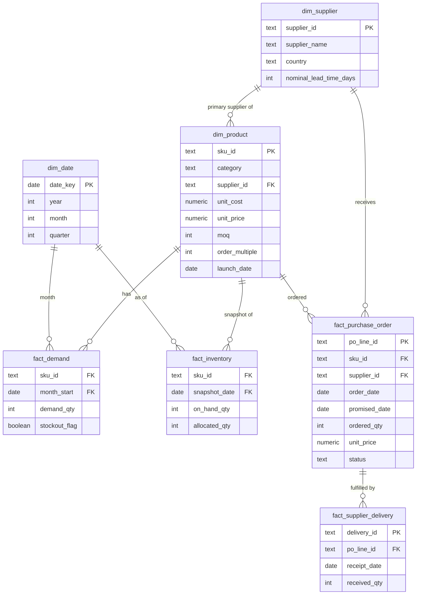

# Methodology

This document defines **every business calculation before it is implemented**:
the formula, the business reasoning, the chosen approach where several exist,
and known limitations. Thresholds referenced here live in
[`src/config.py`](../src/config.py) — nothing is hard-coded in the analytical modules.

> Status: formulas are specified in Phase 1. Each section is marked with the
> phase that implements it; sections are updated if implementation reveals a
> necessary change.

## Contents

1. [Demand management](#1-demand-management)
2. [ABC classification](#2-abc-classification)
3. [XYZ classification](#3-xyz-classification)
4. [ABC-XYZ matrix](#4-abc-xyz-matrix)
5. [Demand forecasting](#5-demand-forecasting)
6. [Forecast accuracy and bias](#6-forecast-accuracy-and-bias)
7. [Lead-time demand](#7-lead-time-demand)
8. [Service levels](#8-service-levels)
9. [Safety stock](#9-safety-stock)
10. [Reorder point and inventory position](#10-reorder-point-and-inventory-position)
11. [Inventory health, days of supply, excess and dead stock](#11-inventory-health-days-of-supply-excess-and-dead-stock)
12. [Supplier performance and OTIF](#12-supplier-performance-and-otif)
13. [Replenishment planning, MOQ and order multiples](#13-replenishment-planning-moq-and-order-multiples)
14. [Working capital and carrying cost](#14-working-capital-and-carrying-cost)
15. [Scenario analysis (S&OP-style)](#15-scenario-analysis-sop-style)
16. [Data model](#16-data-model)

## Notation

| Symbol | Meaning | Unit |
|---|---|---|
| `d` | Mean demand per period | units / month (converted to days where stated) |
| `σ_d` | Standard deviation of demand per period | units / month |
| `L` | Mean supplier lead time | months (converted from days) |
| `σ_L` | Standard deviation of lead time | months |
| `Z` | Standard-normal quantile of the target cycle service level | – |
| `c` | Unit cost | currency / unit |

Unit consistency matters: demand and lead time **must be in the same time
unit** before they are combined. The code converts lead-time days to months
with `DAYS_PER_MONTH = 365 / 12`.

---

## 1. Demand management

*Phase 2 (data) / Phase 5 (forecasting)*

Demand history is stored as **monthly unconstrained sales quantities per SKU**.
Monthly buckets are the usual grain for tactical inventory planning at a
distributor: weekly data is noisier and lead times are measured in weeks to
months.

**Known distortion — censored demand.** When a SKU was stocked out, recorded
sales understate true demand. The synthetic data flags stockout months; the
flag is kept so that (a) the distortion is visible and (b) a future
improvement can impute lost sales. This is documented rather than silently
ignored.

## 2. ABC classification

*Phase 4 — `src/abc_xyz.py`*

**Formula**

```
annual_consumption_value (ACV) = annual_demand_units × unit_cost
```

1. Compute ACV per SKU over the last 12 months of history.
2. Rank SKUs by ACV descending.
3. Compute each SKU's cumulative share of total ACV.
4. Classify by the cumulative share **before** the SKU is added:
   - A: previous cumulative share < `a_threshold` (default 0.80)
   - B: previous cumulative share < `b_threshold` (default 0.95)
   - C: remainder

Using the *previous* cumulative share guarantees that the SKU which crosses
the 80% line is still an A item; otherwise the single largest SKU could be
classified B in a highly concentrated portfolio.

**Why it matters.** Planner time and working capital are limited. ABC
(Pareto) analysis concentrates attention and tighter control where the money
is: typically ~20% of SKUs drive ~80% of value.

**Why cost, not revenue.** ACV at unit cost measures the inventory investment
the SKU drives, which is what inventory policy controls. Revenue- or
margin-based ranking is a valid alternative for commercial prioritisation;
this project uses cost because the decisions are about inventory investment.

**Why configurable.** 80/95 is a convention, not a rule. A business with very
concentrated value might use 70/90; one with abundant planner capacity might
widen class A. Thresholds are in `ABCConfig`.

**Limitations.** ABC is one-dimensional: a cheap item that stops a customer
order line (e.g. a critical spare) can be class C. It also ignores demand
variability — which is why it is combined with XYZ.

## 3. XYZ classification

*Phase 4 — `src/abc_xyz.py`*

**Formula**

```
CV = σ(monthly demand) / mean(monthly demand)
```

| Class | Default rule | Interpretation |
|---|---|---|
| X | CV ≤ 0.50 | Stable, forecastable |
| Y | 0.50 < CV ≤ 1.00 | Moderately variable (trend / seasonality / noise) |
| Z | CV > 1.00 | Highly variable or intermittent |

**Explicit edge cases** (evaluated before the CV rule):

| Case | Treatment | Reason |
|---|---|---|
| Zero demand in the whole window | `NO_DEMAND` (not X/Y/Z) | CV is undefined (0/0); these SKUs are dead-stock candidates, not planning items |
| Fewer than `min_nonzero_periods` non-zero months | Z (flagged `intermittent`) | CV on a few spikes is unstable; intermittent items are genuinely hard to forecast |
| Fewer than `min_history_months` months since launch | `NEW` (flagged) | Insufficient history; classified on available data but flagged for planner review |

Standard deviation uses the sample definition (`ddof=1`).

**Why it matters.** Variability, not volume, drives safety stock. XYZ tells the
planner how much to trust the forecast and how much buffer to hold.

**Limitations.** CV does not distinguish *predictable* variability (seasonality,
trend) from *random* noise: a strongly seasonal SKU may be Y even though a
seasonal model forecasts it well. A refinement is to compute CV on forecast
residuals rather than raw demand — noted in future improvements.

## 4. ABC-XYZ matrix

*Phase 4*

The two classifications combine into nine segments. The recommended policies
below are **starting points** for differentiated planning, not universal
truths; the right policy also depends on customer commitments, shelf life and
supplier flexibility.

| | X (stable) | Y (variable) | Z (erratic) |
|---|---|---|---|
| **A (high value)** | **AX** — tight control, frequent review, lean safety stock, candidate for supplier collaboration / VMI | **AY** — statistical forecast with planner review, moderate safety stock | **AZ** — management attention; consensus forecast, conservative safety stock, consider make-to-order or customer commitments |
| **B** | **BX** — automated replenishment with periodic review | **BY** — standard statistical planning | **BZ** — review forecastability; higher buffer or longer review cycle |
| **C (low value)** | **CX** — simplify: automatic reorder, larger lots to cut ordering effort | **CY** — simple rules, periodic review | **CZ** — review stocking strategy: stock vs. order-on-demand vs. delist |

## 5. Demand forecasting

*Phase 5 — `src/forecasting.py`*

Three transparent methods are compared per SKU:

| Method | Formula | When it works |
|---|---|---|
| Moving average (MA, n=3) | `F(t+1) = mean(A(t-n+1..t))` | Stable demand; smooths noise, lags trends |
| Simple exponential smoothing (SES, α=0.3) | `F(t+1) = α·A(t) + (1−α)·F(t)` | Stable-to-moderate demand; weights recent data more |
| Seasonal naive (m=12) | `F(t) = A(t−12)` | Seasonal demand with a stable yearly pattern |

A weighted moving average (weights 0.2/0.3/0.5) is available as an
alternative to SES. The **naive MA acts as the baseline**: a method is only
worth using if it beats it.

**Validation design.** Time-based hold-out: train on months 1–18, test on
the last 6 (`test_months`). Forecasts are generated as a rolling one-step-ahead
over the test window using only data available at the time.

**Time-series data is never randomly split**, because that leaks future
information into training (the model "sees" June when forecasting May) and
produces over-optimistic accuracy that will not hold in production.

**Method selection.** Per SKU, choose the method with the lowest test-period
WAPE (ties → simpler method). Seasonal naive is only eligible when at least
24 months of history exist. Choosing by validation performance, rather than
assuming one method is best, is the standard "forecast competition" approach.

**Limitations.** No causal drivers (price, promotions), no hierarchy
reconciliation, and intermittent demand would be better served by Croston /
SBA methods (future improvement). These methods are chosen for
explainability, not maximum accuracy.

## 6. Forecast accuracy and bias

*Phase 5 — `src/forecast_accuracy.py`*

With actuals `A` and forecasts `F` over the test window:

| Metric | Formula | What it tells the business |
|---|---|---|
| MAE | `mean(|A − F|)` | Typical error in units |
| RMSE | `sqrt(mean((A − F)²))` | Penalises large misses (big misses cause stockouts) |
| WAPE | `Σ|A − F| / ΣA` | Scale-free error, weighted to volume; comparable across SKUs |
| Bias | `Σ(F − A) / ΣA` | Systematic direction: **positive = over-forecast** (excess inventory), **negative = under-forecast** (stockouts) |

**Zero-demand handling.** MAPE is deliberately not used: it divides by each
period's actual and explodes on zeros. WAPE and bias divide by *total* actual;
if total actual is zero they return `NaN` (reported, not hidden).

**Why bias matters separately from accuracy.** Two forecasts can have the same
WAPE while one consistently over-forecasts. Bias is a behavioural and
process signal (e.g. sales optimism) and translates directly into excess or
shortage.

## 7. Lead-time demand

*Phase 6 — `src/safety_stock.py`*

```
lead_time_demand = d × L
```

This is the stock expected to be consumed while waiting for a replenishment
order to arrive. Forward-looking `d` uses the selected forecast (not simply
history) so that trends and seasonality feed into replenishment.

## 8. Service levels

*Phase 6*

This project uses **cycle service level (CSL)**: the probability of *not*
stocking out during a replenishment cycle. It maps directly to the Z-score:

| CSL | Z | Default use |
|---|---|---|
| 90% | 1.2816 | C items |
| 95% | 1.6449 | B items |
| 98% | 2.0537 | A items |

`Z = norm.ppf(CSL)` (see `service_level_to_z` in `src/config.py`).

CSL is chosen over fill rate (share of demand met from stock) because it gives
a transparent closed-form safety-stock formula. Fill rate is usually higher
than CSL for the same stock; the distinction is documented in the interview
guide. Service level targets are by ABC class; the relationship is **not
linear** — going from 95% to 98% costs far more safety stock than 90% → 93%.

## 9. Safety stock

*Phase 6*

**Demand-variability-only** (lead time assumed fixed):

```
SS = Z × σ_d × √L
```

**Demand + lead-time variability** (independent, normally distributed):

```
SS = Z × √( L × σ_d² + d² × σ_L² )
```

The second form is used by default (`include_lead_time_variability=True`)
because supplier lead-time variability is a stated business problem; it
reduces to the first form when `σ_L = 0`. `σ_L` comes from the supplier's
historical delivery performance (Phase 7), linking supplier reliability
directly to inventory investment.

**Assumptions:** demand is approximately normal and independent between
periods; lead time is independent of demand. These are weakest for
intermittent (Z) items — see `docs/assumptions.md`.

## 10. Reorder point and inventory position

*Phase 6*

```
ROP = lead_time_demand + SS = d × L + SS
inventory_position = on_hand + open_po_qty − allocated_qty
```

The trigger is `inventory_position < ROP`, **not** on-hand < ROP: stock
already on order will arrive within the lead time, so comparing on-hand alone
would cause duplicate orders. Allocated (committed to customer orders but not
yet shipped) stock is subtracted because it is not available to cover new
demand.

## 11. Inventory health, days of supply, excess and dead stock

*Phase 6 — `src/inventory_health.py`*

```
average_daily_demand = d / DAYS_PER_MONTH
days_of_supply (DOS) = on_hand / average_daily_demand        (∞ if demand = 0)
inventory_value      = on_hand × unit_cost
target_max_units     = SS + average_daily_demand × excess_days_of_supply
excess_units         = max(0, on_hand − target_max_units)
excess_value         = excess_units × unit_cost
```

**Status rules** (first match wins, so every SKU gets exactly one status):

| Priority | Status | Rule |
|---|---|---|
| 1 | STOCKOUT | on_hand ≤ 0 and demand > 0 |
| 2 | CRITICAL | on_hand < SS |
| 3 | BELOW_REORDER_POINT | inventory_position < ROP |
| 4 | DEAD_STOCK | on_hand > 0 and no demand in last `dead_stock_months_without_demand` months |
| 5 | EXCESS | excess_units > 0 |
| 6 | HEALTHY | otherwise |

**Dead stock value** = full on-hand value of DEAD_STOCK SKUs (all of it is
at risk of write-off, not just the portion above target).

**Why excess is working-capital exposure.** Every unit above what projected
demand and safety stock require is cash sitting on a shelf: it incurs
carrying cost (§14), occupies warehouse space and risks obsolescence, and
could otherwise fund inventory for SKUs that are short.

## 12. Supplier performance and OTIF

*Phase 7 — `src/supplier_analysis.py`*

Per delivery line:

```
on_time  = receipt_date ≤ promised_date + on_time_tolerance_days
in_full  = received_qty ≥ ordered_qty × in_full_tolerance
OTIF     = on_time AND in_full
```

| Supplier metric | Formula |
|---|---|
| Total spend | Σ received_qty × unit_price |
| OTIF % | OTIF lines / total lines |
| Fill rate | Σ received_qty / Σ ordered_qty |
| Average lead time | mean(receipt_date − order_date) in days |
| Lead-time variability | std and CV of actual lead time |
| Average delay | mean(max(0, receipt_date − promised_date)) |
| Purchase price variance (PPV) | Σ (actual_price − standard_cost) × received_qty |

OTIF is measured **per order line** (the common strict definition). A late
but complete delivery and an on-time short delivery both fail.

**Segmentation** (thresholds in `SupplierConfig`, rationale in
`docs/business_logic.md`): *Strategic/Reliable* (OTIF ≥ 95% and lead-time CV ≤
0.30), *Watch* (OTIF 85–95% or high variability), *At Risk* (OTIF < 85%).
Spend is shown alongside so that high-spend at-risk suppliers stand out.

## 13. Replenishment planning, MOQ and order multiples

*Phase 8 — `src/replenishment.py`*

An (s, S)-style order-up-to policy with a monthly review:

```
target_level (S)  = forecast demand over (L + review period) + SS
if inventory_position < ROP:
    raw_qty   = S − inventory_position
    order_qty = ceil( max(raw_qty, MOQ) / order_multiple ) × order_multiple
else:
    order_qty = 0
```

Reason codes (evaluated in order): `STOCKOUT_RISK` (projected on hand at
lead-time end < 0), `SAFETY_STOCK_RISK` (projected < SS), `BELOW_ROP`,
`EXCESS_ALREADY_PRESENT` (no order; inventory above target max),
`NO_ORDER_REQUIRED`.

**MOQ trade-off.** When MOQ > required quantity, the system still orders the
MOQ (the supplier will not accept less) but reports the **MOQ-driven excess**
(`order_qty − raw_qty`) so buyers can see its inventory cost and negotiate.

## 14. Working capital and carrying cost

*Phase 9 — `src/working_capital.py`*

```
inventory_value     = Σ on_hand × unit_cost
annual_carrying_cost = inventory_value × annual_carrying_cost_rate   (default 25%)
excess_share        = excess_value / inventory_value
dead_stock_share    = dead_stock_value / inventory_value
```

Inventory is a current asset funded by cash. Reducing excess and dead stock
releases cash; raising service levels consumes it. Reports split inventory
value by ABC class, supplier and category to show *where* the capital sits.

## 15. Scenario analysis (S&OP-style)

*Phase 9*

The same pipeline is re-run with a modified configuration / input set:

| Scenario lever | Implementation |
|---|---|
| Demand growth | Multiply forward forecast by (1 + g) |
| Service level | Override CSL targets |
| Supplier lead time | Multiply `L` by (1 + x) |
| Supplier variability | Multiply `σ_L` by (1 + y) |

Outputs (safety stock, inventory value implied by policy, stockout exposure,
recommended order value, working capital) are compared to the base case.
**Scenario outputs are projections, labelled `scenario_*`, and never overwrite
historical actuals.**

## 16. Data model

*Phase 3 — finalised in `sql/schema.sql`. Draft ERD:*


